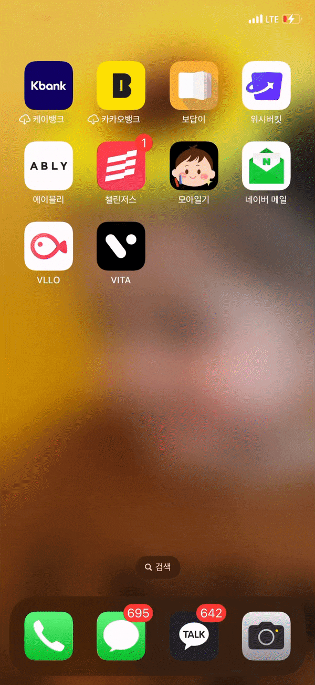
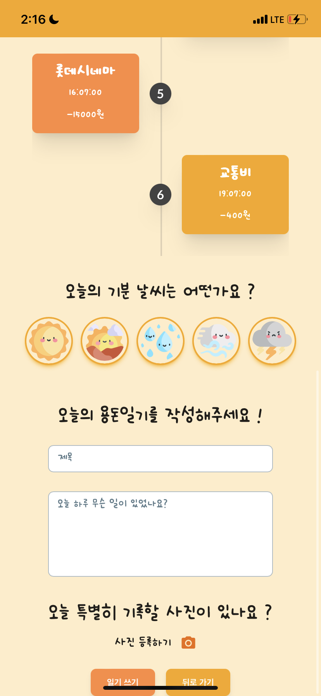
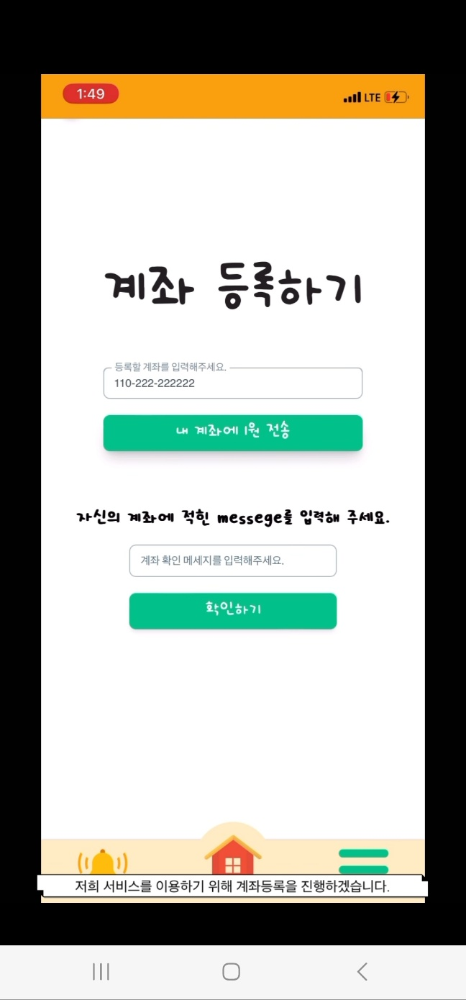
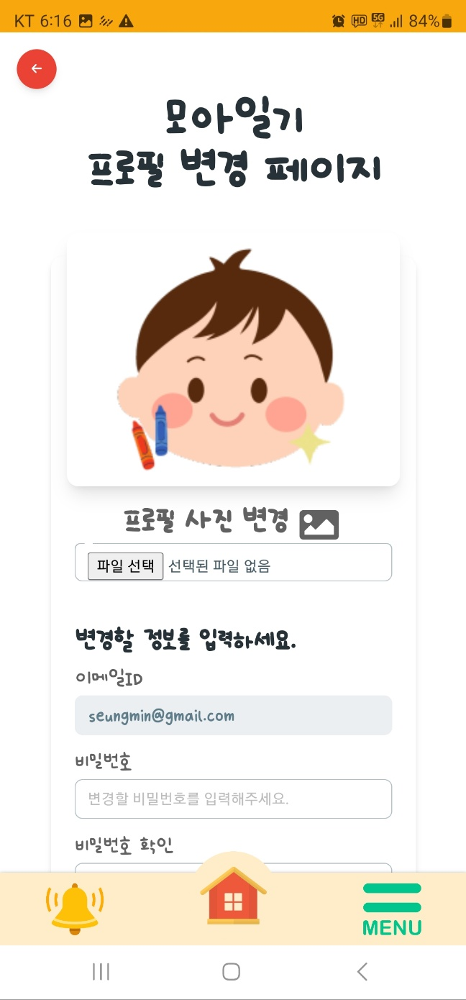
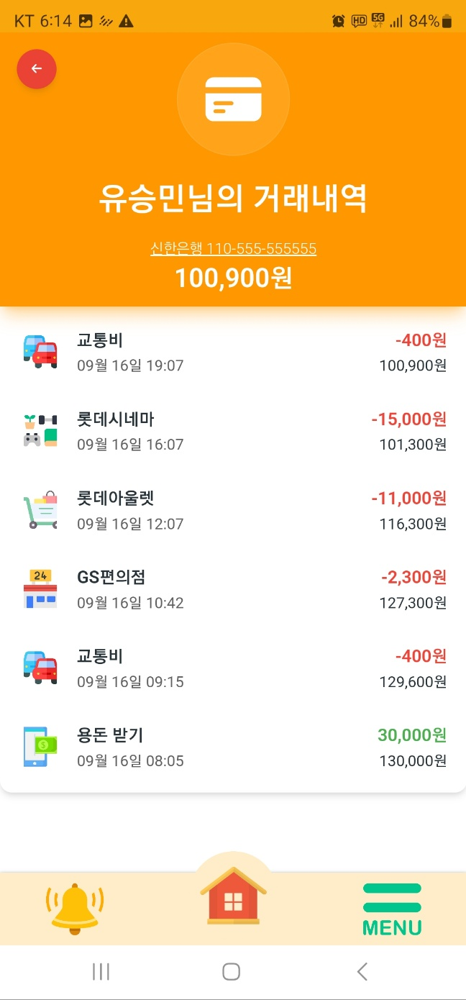
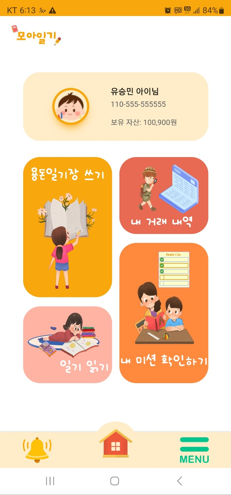
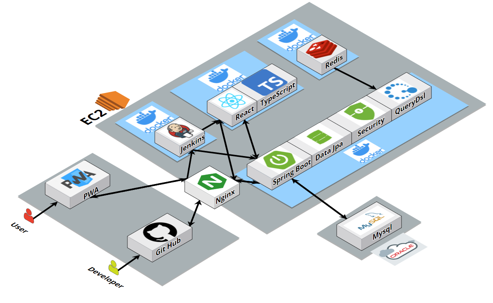
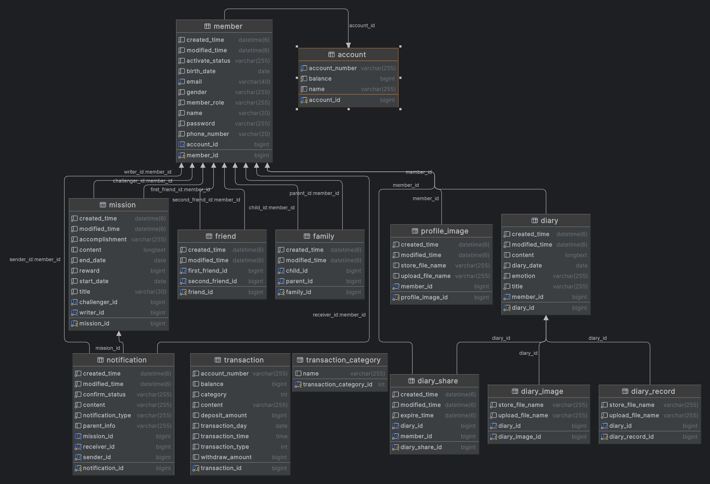

# 모아일기
### 📖용돈 기입과 일기를 한번에, 용돈 일기장 모아일기📖


## ⌛️ 프로젝트 진행 기간

### **2023-09-01 ~ 2023-09-17 (17일)**
<br>

## 👪팀원 소개
멋쟁이 팀원들을 소개할게요. 😊

### 🧑 김성준

- FrontEnd
- GitHub : [ksungjoon](https://github.com/ksungjoon)


### 👦 이지헌

- FrontEnd
- GitHub : [heon-2](https://github.com/heon-2)


### 👨 김하영

- 팀장, BackEnd
- GitHub : [bnk159hair](https://github.com/bnk159hair)


### 🧒 유승민

- BackEnd
- GitHub : [byuri1356](https://github.com/byuri1356)

<br>


## 📚 프로젝트 소개

### 핀테크 연결과 확장을 주제로
### 용돈기입과 일기를 한번에 작성할 수 있는
### 아이 친화적인 UI를 제공하는 웹앱 애플리케이션 입니다

<br>

## 🔎 서비스 주요 기능
### 1) 용돈 일기장  
- 해당 날짜의 거래내역을 불러와 거래내역을 보며 일기를 쓸 수 있음
### 2) 미션
- 부모님들은 아이에게 미션을 부여할 수 있음
- 미션 성공시 보상으로 걸린 금액만큼 자동 인출됨
### 3) 일기 공유
- 모든 이용자들은 링크를 통해 일기내용을 공유 할 수 있음
- 일정 시간이 지날 시 링크가 만료됨


## 🔎 서비스 주요 기술
### 로딩 페이지

### **Server-Sent Events**
- 알림 서비스를 실시간으로 받아보기 위한 기술

### **Gmail Api**
- 이메일 인증 서비스를 위한 기술

### **일기공유**
- 링크로 일기를 공유하기 위한 기술
- 일정 시간이 지나면 링크가 만료됨

<br>

## 서비스 화면

### 🎬[시연영상](./docs/images/시연영상.mp4)

### 로딩

<br>

### 일기장



<br>

### 미션 등록


<br>

### 계좌 등록



<br>

### 프로필 변경



<br>

### 내역 조회



<br>

### 메인페이지



<br>


### 

<br>


## 🧩협업 도구
### Git Hub
### Notion
### MatterMost

<br>

## 📂 시스템 아키텍처



<br>

## 📂 ERD


<br>

## 📦 프로젝트 파일 구조
### FrontEnd
```
SRC
├─asset
│  └─background
├─components
│  ├─ChildDiary
│  ├─ChildMain
│  ├─ChildMisson
│  ├─ChildTrade
│  ├─ChildWrite
│  ├─Common
│  ├─Login
│  ├─ParentGiveMission
│  ├─ParentGiveMoney
│  ├─ParentMain
│  ├─ParentMission
│  ├─ParentPattern
│  ├─ParentRegister
│  └─ParentTrade
├─pages
│  ├─ChildPage
│  │  ├─ChildDiaryPage
│  │  ├─ChildMainPage
│  │  ├─ChildMissionPage
│  │  ├─ChildTradePage
│  │  └─ChildWritePage
│  ├─CommonPage
│  ├─LoginPage
│  └─ParentPage
│      ├─ParentGiveMissionPage
│      ├─ParentGiveMoneyPage
│      ├─ParentMainPage
│      ├─ParentMissionPage
│      ├─ParentPatternPage
│      ├─ParentRegisterPage
│      └─ParentTradePage
└─store
```
<br>

### BackEnd
```

ijoa
 ├─api
 │  ├─controller
 │  │  ├─alarm
 │  │  │  └─dto
 │  │  │      └─request
 │  │  ├─bank
 │  │  │  └─dto
 │  │  │      └─request
 │  │  ├─diary
 │  │  │  └─dto
 │  │  │      └─request
 │  │  └─member
 │  │      └─dto
 │  │          └─request
 │  └─service
 │      ├─alarm
 │      │  ├─command
 │      │  └─dto
 │      │      ├─request
 │      │      └─response
 │      ├─bank
 │      │  ├─command
 │      │  └─dto
 │      │      └─response
 │      ├─diary
 │      │  ├─command
 │      │  ├─dto
 │      │  │  ├─request
 │      │  │  └─response
 │      │  └─query
 │      └─member
 │          ├─command
 │          ├─dto
 │          │  ├─request
 │          │  └─response
 │          └─query
 ├─common
 │  ├─config
 │  ├─error
 │  │  └─exception
 │  ├─filter
 │  ├─model
 │  ├─response
 │  └─util
 └─domain
     ├─bank
     │  ├─entity
     │  └─repository
     │      ├─datajpa
     │      └─query
     ├─diary
     │  ├─entity
     │  └─repository
     │      ├─datajpa
     │      └─query
     └─member
         ├─entity
         │  └─enums
         └─repository
             ├─datajpa
             └─query
```

<br>

## 📔 참조 문서
### [컨벤션](./docs/convention.md)

