# 모아일기

### 📖용돈 기입과 일기를 한번에, 용돈 일기장 모아일기📖

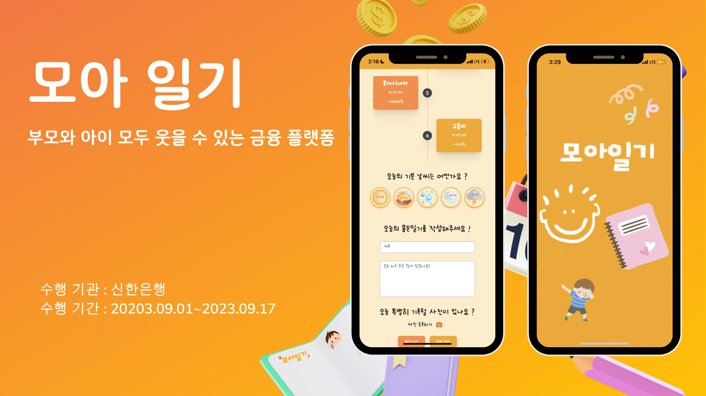

## ⌛️ 프로젝트 진행 기간

### **2023-09-01 ~ 2023-09-17 (17일, 오프라인 해커톤 대회 1박 3일 포함)**

<br>

## 📚 프로젝트 소개

### '2023년 신한은행 해커톤 with SSAFY'에 참가해 '핀테크 : 연결과 확장'을 주제로 진행한 프로젝트입니다.

### 모아일기는 용돈 기입과 일기 작성을 동시에 작성하며 아이들의 올바른 소비 습관 회고를 돕는

### 아이 친화적인 UI/UX를 제공하는 웹앱 애플리케이션 입니다.

<br>

## 🔎 서비스 주요 기능

### 1) 용돈 일기장

- 해당 날짜의 거래내역을 불러와 거래내역을 보며 일기를 쓸 수 있음.

### 2) 용돈 미션 부여

- 부모님들은 아이에게 미션을 부여할 수 있음.
- 아이가 미션을 성공하면, 보상으로 걸린 금액만큼 아이의 계좌에 입금됨.

### 3) 일기 공유

- 모든 이용자들은 링크를 통해 일기내용을 공유 할 수 있음
- 일정 시간이 지날 시 링크가 만료됨

<br>

## 🛠️ 주요 기술

### 🔧 BackEnd

Spring Boot, JPA, QueryDSL, Spring security, Swagger

### ⚛️ FrontEnd

React.js, TypeScript, PWA, Zustand, Tailwind CSS, Styled-Components

### ☁️ InfraStructor

AWS EC2, Nignx, Docker, Jenkins

### 🔐 Authencation

JWT

### 💾 Data

MySQL, Redis

### 💬 Collaborate

GitLab, Figma, Notion, MatterMost

### 🌟 Etc

신한 해커톤 API, Google SMTP, SSE(Server-Sent-Event)

<br>

## 👪팀원 소개

모아일기를 만들기 위해 고생한 멋쟁이 팀원들을 소개할게요. 😊

<table align="center">
    <tr align="center">
        <td colspan="2"><h2>🖌️ FrontEnd</h2></td>
        <td colspan="2"><h2>🗄️ BackEnd</h2></td>
    </tr>
    <tr align="center">
        <!-- FrontEnd Developers -->
        <td style="min-width: 150px;">
            <a href="https://github.com/ksungjoon">
              
              <br /><b>ksungjoon</b>
            </a>
        </td>
        <td style="min-width: 150px;">
            <a href="https://github.com/heon-2">
              
              <br /><b>heon-2</b>
            </a> 
        </td>
        <!-- BackEnd Developers -->
        <td style="min-width: 150px;">
            <a href="https://github.com/bnk159hair">
              
              <br /><b>bnk159hair</b>
            </a> 
        </td>
        <td style="min-width: 150px;">
            <a href="https://github.com/marugy">
              
              <br /><b>byuri1356</b>
            </a> 
        </td>
    </tr>
    <tr align="center">
        <td>김성준</td>
        <td>이지헌</td>
        <td>김하영</td>
        <td>유승민</td>
    </tr>
</table>

# 주요 서비스 화면 소개 💡

- 모아일기의 주요 서비스 화면 소개입니다.

### 🎬[시연영상](./docs/images/시연영상.mp4)

<br>

|            랜딩 페이지 및 로그인            |                              계좌 등록                              |
| :-----------------------------------------: | :-----------------------------------------------------------------: |
|              |             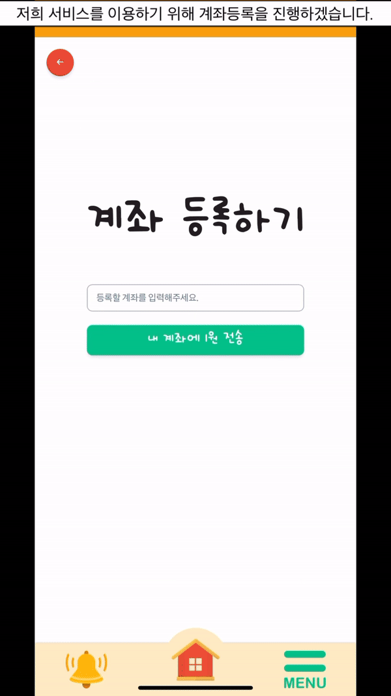             |
| 모바일 환경에서 접속해 로그인을 진행합니다. | 유효한 계좌를 입력 후, 입금된 1원의 거래 메세지 4글자를 입력합니다. |

- PWA를 사용해 웹뿐만 아니라 모바일 환경에서도 실행할 수 있게 하였습니다.
- 등록할 계좌를 입력하면 해당 계좌에 무작위 4글자의 메세지가 담긴 1원이 입금됩니다. 사용자는 해당 메세지를 입력하여 계좌 등록을 완료합니다.

<br><br>

|               용돈 미션 부여               |                         지난 일기 읽기                          |
| :----------------------------------------: | :-------------------------------------------------------------: |
|    |                               |
| 부모는 아이에게 미션을 부여할 수 있습니다. | 아이는 작성했던 일기들을 읽고 이를 사람들과 공유할 수 있습니다. |

- 부모는 아이의 올바른 소비 습관 형성을 위해 리워드가 있는 미션을 부여할 수 있습니다.
- 아이가 미션을 완료하면 부모님에게 완료 요청을 보낼 수 있고 부모가 승인을 누를시에 아이는 용돈을 지급받을 수 있습니다.
- 부모가 미션을 등록하면 아이의 화면에 실시간 알림이 전송되며, SSE(Server Sent Events)를 이용해 구현하였습니다.
- 아이는 과거 일기를 링크로 연결해 다른 사람들에게 공유할 수 있습니다. 링크는 유출 방지와 서버 부하 방지를 위해 일정 시간이 지나면 만료됩니다.

|                아이 메인 페이지                 |           부모 메인 페이지            |
| :---------------------------------------------: | :-----------------------------------: |
| 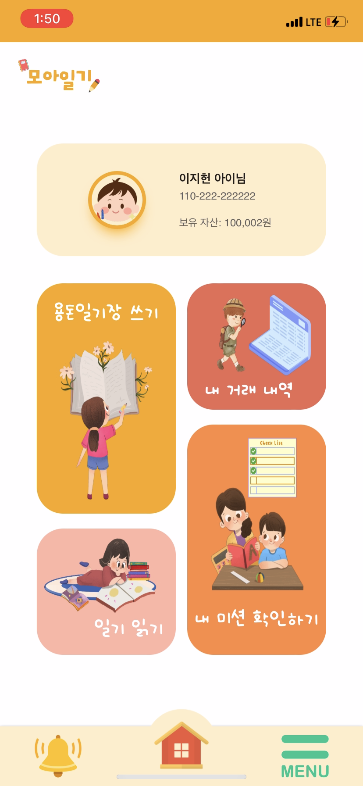 | 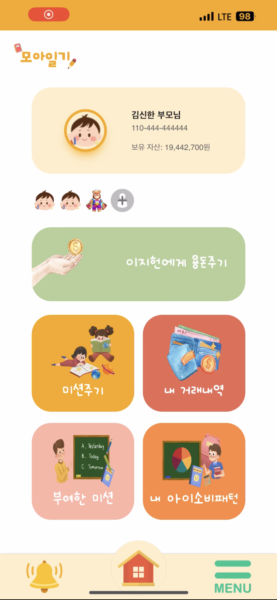 |
|            아이의 메인 페이지입니다.            |       부모의 메인 페이지입니다.       |

- 회원가입 때 선택한 Role에 따라 부모 혹은 아이 페이지로 이동합니다.
- 아이는 `용돈일기장 쓰기`, `거래 내역`, `일기 읽기`, `내 미션 확인하기` 4가지 기능이 있습니다.
- 부모는 `용돈주기`, `미션주기`, `거래 내역`, `부여한 미션`, `내 아이 소비패턴` 5가지 기능이 있습니다.
- 부모는 + 버튼을 눌러 추가로 아이를 등록할 수 있고, 여러 아이들에게 각각 용돈과 미션을 부여할 수 있습니다.

|                     이메일 인증                      |              이메일 인증 번호 확인              |
| :--------------------------------------------------: | :---------------------------------------------: |
|     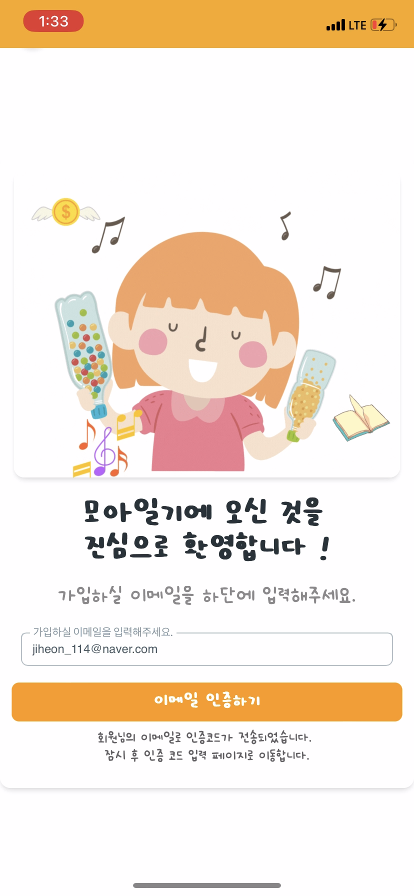     | 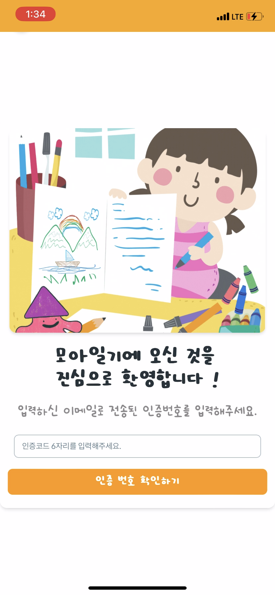 |
| 이메일을 입력하면 해당 메일로 인증코드가 전송됩니다. |  인증코드 6자리를 입력하면 인증이 완료됩니다.   |

- `Gmail API`를 사용하여 이메일 인증을 구현했습니다.

|                   소비패턴                   |                회원가입                |
| :------------------------------------------: | :------------------------------------: |
|    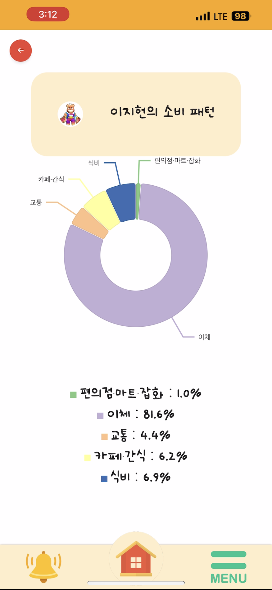     | 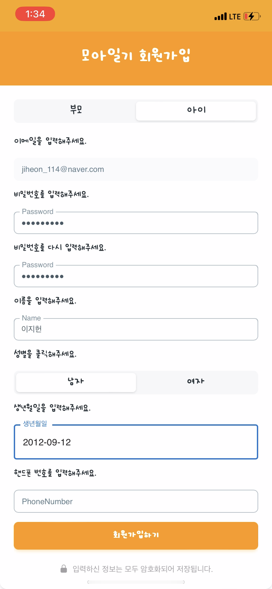 |
| 부모는 아이의 소비패턴을 확인할 수 있습니다. |         회원가입을 진행합니다.         |

|                        거래내역                        |                       미션 조회                        |
| :----------------------------------------------------: | :----------------------------------------------------: |
|         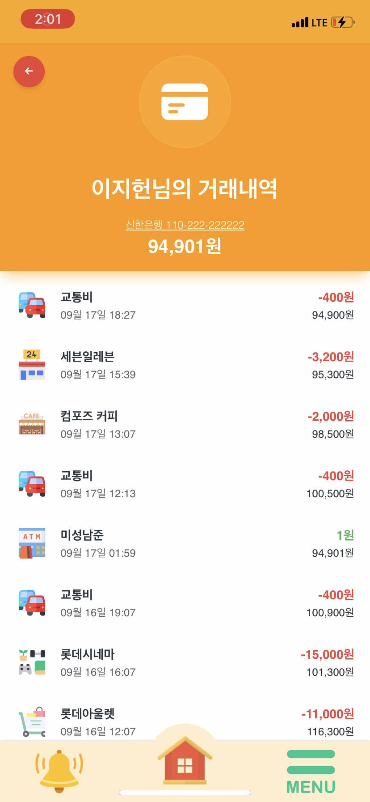          |         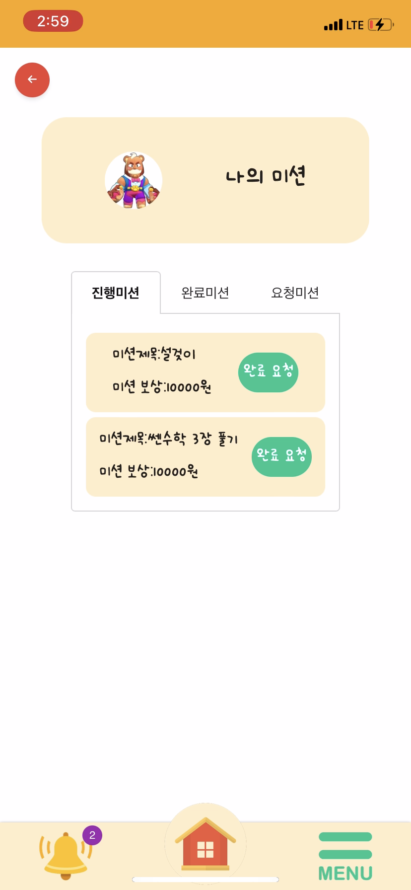         |
| 모든 사용자는 등록한 계좌의 거래내역을 볼 수 있습니다. | 진행중인 미션과 과거 완료한 미션을 확인할 수 있습니다. |

|                   용돈 일기장 작성1                    |                                용돈 일기장 작성2                                |
| :----------------------------------------------------: | :-----------------------------------------------------------------------------: |
|       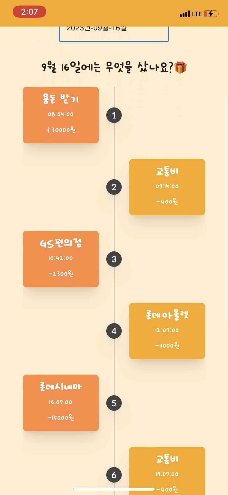       |                                              |
| 아이는 거래 타임라인을 보며 소비를 회고할 수 있습니다. | 오늘의 기분을 날씨로 표현하고, 특별한 기록이 있다면, 사진을 등록할 수 있습니다. |

###

<br>

## 🧩협업 도구

### Git Hub

### Notion

### MatterMost

<br>

## 📂 시스템 아키텍처


<br>

## 📂 ERD


<br>

## 📦 프로젝트 파일 구조

### FrontEnd

```
SRC
├─asset
│  └─background
├─components
│  ├─ChildDiary
│  ├─ChildMain
│  ├─ChildMisson
│  ├─ChildTrade
│  ├─ChildWrite
│  ├─Common
│  ├─Login
│  ├─ParentGiveMission
│  ├─ParentGiveMoney
│  ├─ParentMain
│  ├─ParentMission
│  ├─ParentPattern
│  ├─ParentRegister
│  └─ParentTrade
├─pages
│  ├─ChildPage
│  │  ├─ChildDiaryPage
│  │  ├─ChildMainPage
│  │  ├─ChildMissionPage
│  │  ├─ChildTradePage
│  │  └─ChildWritePage
│  ├─CommonPage
│  ├─LoginPage
│  └─ParentPage
│      ├─ParentGiveMissionPage
│      ├─ParentGiveMoneyPage
│      ├─ParentMainPage
│      ├─ParentMissionPage
│      ├─ParentPatternPage
│      ├─ParentRegisterPage
│      └─ParentTradePage
└─store
```

<br>

### BackEnd

```

ijoa
 ├─api
 │  ├─controller
 │  │  ├─alarm
 │  │  │  └─dto
 │  │  │      └─request
 │  │  ├─bank
 │  │  │  └─dto
 │  │  │      └─request
 │  │  ├─diary
 │  │  │  └─dto
 │  │  │      └─request
 │  │  └─member
 │  │      └─dto
 │  │          └─request
 │  └─service
 │      ├─alarm
 │      │  ├─command
 │      │  └─dto
 │      │      ├─request
 │      │      └─response
 │      ├─bank
 │      │  ├─command
 │      │  └─dto
 │      │      └─response
 │      ├─diary
 │      │  ├─command
 │      │  ├─dto
 │      │  │  ├─request
 │      │  │  └─response
 │      │  └─query
 │      └─member
 │          ├─command
 │          ├─dto
 │          │  ├─request
 │          │  └─response
 │          └─query
 ├─common
 │  ├─config
 │  ├─error
 │  │  └─exception
 │  ├─filter
 │  ├─model
 │  ├─response
 │  └─util
 └─domain
     ├─bank
     │  ├─entity
     │  └─repository
     │      ├─datajpa
     │      └─query
     ├─diary
     │  ├─entity
     │  └─repository
     │      ├─datajpa
     │      └─query
     └─member
         ├─entity
         │  └─enums
         └─repository
             ├─datajpa
             └─query
```

<br>

## 📔 참조 문서

### [컨벤션](./docs/convention.md)
